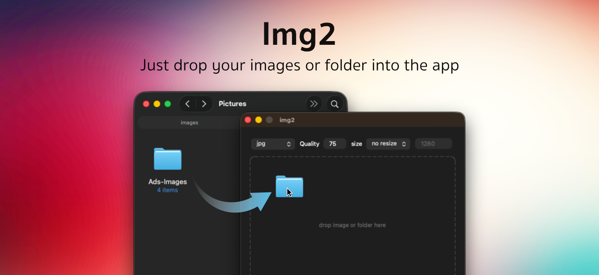
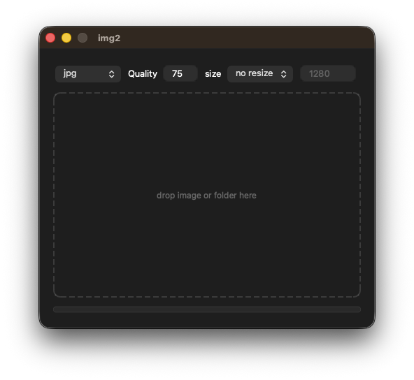

<div align="center">
  <h1>Img2 - Simple image converter</h1>
  <p>Simple image converter app allow you to quickly change file formats (jpg, jpeg, png, webp, avif, heic, tiff, gif, bmp, ico, cur, svg, ppm) into (jpg, png, gif, webp, avif, ico), resize, or compress images directly on your Mac. Just drop your images or folder into the app.</p>
</div>

<p align="center">
  <a href="https://buymeacoffee.com/chaitat">
    
  </a>
</p>


## Installation

### Homebrew (recommended)

```bash
brew install chaitat/homebrew-img2/img2
```

This will automatically install ImageMagick if not already installed.

### Download .dmg 

Download the latest release from [GitHub Releases.](https://github.com/chaitat/img2/releases)

### Manual

1. Install [ImageMagick](https://imagemagick.org/):
   ```bash
   brew install imagemagick
   ```

2. Install Python dependencies:
   ```bash
   pip install -r requirements.txt
   ```

3. Run the app:
   ```bash
   python img2.py
   ```

### Update app version
```bash
brew upgrade img2
```

## Usage



1. Select output format (jpg, png, gif, webp, avif, ico)
2. Set quality (1-100)
3. Optionally resize:
   - No resize
   - Fix width (enter pixel value)
   - Fix height (enter pixel value)
4. Drag and drop images or folders onto the app
5. Converted images are saved in `img2<format>` folder next to original

## macOS Security

Since this app is not code-signed (to keep it free and open source), macOS may block it from running. You may see a security warning like "img2.app cannot be opened because it is from an unidentified developer."

### How to Run

**Option 1: Right-click to open**
1. Right-click on `img2.app`
2. Select "Open"
3. Click "Open" in the dialog

**Option 2: Override in System Settings**
1. Go to **System Settings** → **Privacy & Security**
2. Scroll down to "Security" section
3. Click "Open Anyway" next to the warning about img2

This is a one-time step. After you allow it once, the app will run normally.

### Why isn't this app signed?

Code signing and notarization requires:
- Apple Developer Program membership ($99/year)
- Code signing certificate

As an open-source project, we keep the app free by skipping these paid requirements. The app is safe - you can verify the code yourself on GitHub.

## License

MIT